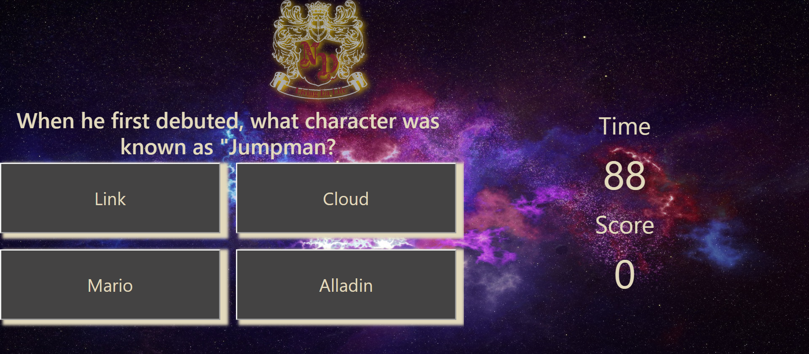
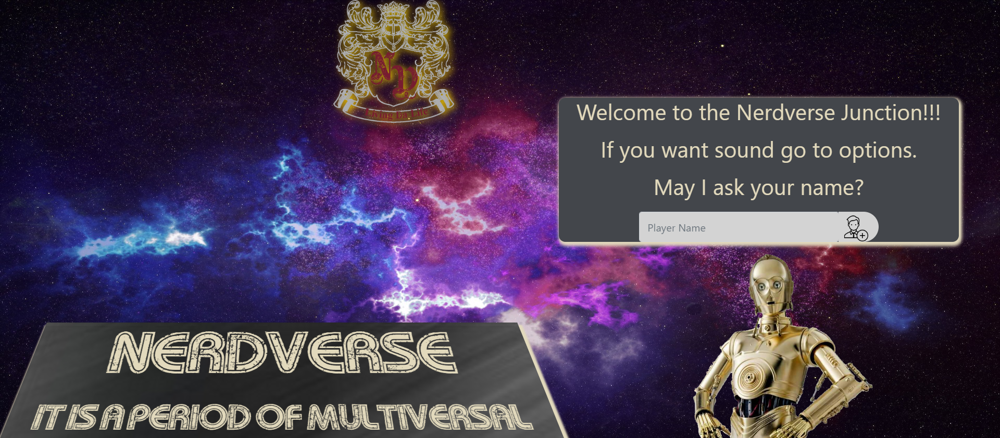

# nerdverse

Basic trivia game about popular science fiction tv shows and movies. Starts out with a dialogue introduction then ask questions with four answer. You start out with 90 seconds and if get a question wrong you lose 10 seconds. If you get it right you get 1 point. After ten questions or time runs out, game end and high score list is displayed. 

### [Launch nerdverse >](https://geertza.github.io/NerdVerse/)

### Background
Just a little distraction in life for those who enjoy sci-fi pop culture.

### Features
Cheap b rated effects and dialogue, plus some interesting trivial facts.

### Tech

- [JQuery, maybe](https://jquery.com/)
- CSS Framework(bootstrap)(animation)(web-kit)
-gimp(for image editing) 

### Roadmap 
Many more questions, different level with  user accounts and different genres of "nerd" culture. Distracting side bar activies like host comments and hints, enemy icons with healthbars, and boss fights. Extra rounds with different games, ex. "javascript algorithm to defeat the borg" 

### Resources
space background provided by,
Oleg Gamulinskiy       @      https://pixabay.com/

all other images sourced through       PNGFuel.com

